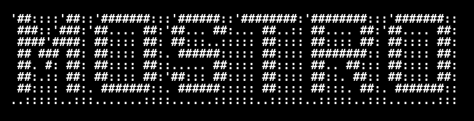
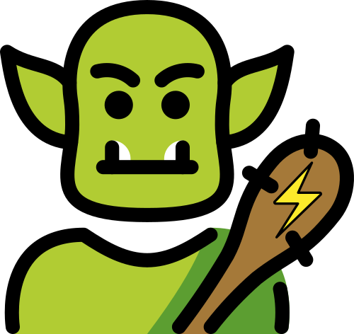

# MOSTRO 🧌




---

**NOTE:** This in an ugly and bad coded first implementation of a lightning network bot on nostr, just to write some ideas I have in mind to see if they are doable, guest what, they are 😀, now that I know that it works I can start working on it.

If you wanna help just open an issue or a discussion.

---

Due to the growing need to be able to operate with Bitcoin without giving up personal data, last year I started a [project](https://github.com/lnp2pBot/bot) to allows people to buy and sell Bitcoin through Lightning Network without funds custody and of course without KYC, this project is a telegram bot called [@lnp2pbot](https://lnp2pbot.com/).

@lnp2pBot is growing steadily and organically, it's being use in the whole world but is having a bigger impact in Latin-America, a place where there is no need to explain to people that money is broken, it's being used more and more in dictatorial regimes like Cuba and Venezuela, where people keep resisting tyranny and protesting using less the local currency and more Bitcoin.

Although the bot works excellent, it's running on top of Telegram, a great platform but we do not know if one day it will be reached by the tentacles of a powerful government asking for political dissidents or simply awkward public person.

This is where enter [nostr](https://github.com/nostr-protocol/nips) as a platform where the bot can live without the possibility of being censored by a powerful entity, a month ago I started to research about nostr to see if we can create a new bot version, a censorship resistant version that makes it unstoppable, a new **Monster** version, it's possible.

## Requirements:

0. You need Rust version 1.65.0 or higher to compile.

## Get the code

```bash
$ git clone https://github.com/grunch/mostro.git
$ cd mostro
# we create the .env file
$ cp .env-sample .env
```

To interact with a lightning node for development, just download [polar](https://lightningpolar.com/) and fill the `LND_` vars from the connection tab.

If you don't have a nostr private key you can use [rana 🐸](https://github.com/grunch/rana) to generate a new one.

## Running it:

To compile on Ubuntu/Pop!\_OS/Debian, please install [cargo](https://www.rust-lang.org/tools/install), then run the following commands:

```
$ sudo apt update
$ sudo apt install -y cmake build-essential pkg-config libssl-dev
```

Then run it:

```bash
$ cargo run
```

Go to from [astral.ninja](https://astral.ninja) and with another user start following your bot and write a message to the bot `!invoice hello world`, if everthing went good you will see in the bot console a message with a new invoice with a description = `hello world`.
